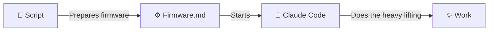

# Engineering @ Ivy

At least how it looks like this week...

by Niels Bosma (niels@ivy.app)

---
layout: center
---

# 3 Ideas I Want to Share

<v-clicks>

1. **CLIs > MCPs** — tools that actually work
2. **Promptware** — software made of prompts
3. **Harness** — the system that ties it together

</v-clicks>

---
layout: center
---

# 🍽️ CLI Eats MCP for Breakfast

Claude Code **excels** at working with CLIs — give it access to everything it needs:

<v-clicks>

`gh` · `gws` · `az` · `aws` · `gcloud` · `kubectl` · `docker` · `terraform`

CLIs offer **progressive disclosure** — easy to build for both humans and LLMs, and **a lot more token-efficient**.

</v-clicks>

---

# 🛠️ Make Your Own CLIs

Don't have a CLI? **Build one.** It's easier than building an MCP server.

<v-clicks>

- I use **Spectre.Console** (.NET) with **OpenCLI** support — self-explaining CLIs
- `<mycli> cli explain` — the CLI describes itself to the agent
- **LLM-optimized by default** — always returns YAML (compact, readable, token-efficient)
- Wrapping an API into a CLI is a **5-minute task** for Claude Code

</v-clicks>

<v-click>


</v-click>

---

# Promptware

What if agents were more like software?

<v-clicks>

- **Source code** → `Program.md` that evolves over time
- **Memory** → persistent knowledge across sessions
- **Tools** → scripts the agent creates for itself
- **Logs** → execution history

</v-clicks>

<v-click>

```
MyAgent/
  Program.md    -- The "source code"
  Memory/       -- Persistent knowledge
  Tools/        -- Self-created scripts
  Logs/         -- Execution history
```

</v-click>

---
layout: center
---

# Firmware



Every agent runs the same cycle:

<v-clicks>

1. 📖 **Read** `Program.md` — your instructions
2. 🧠 **Load** your tools and memory
3. ⚡ **Execute** the task
4. 🔄 **Reflect** — update Program.md, Memory, or Tools

</v-clicks>

<v-click>

<div class="mt-6 p-4 bg-green-500 bg-opacity-10 rounded-lg">

The firmware **never changes**. The Program.md **evolves** — every run gets smarter.

</div>

</v-click>

---

# Promptwares We Use @ Ivy

<div class="grid grid-cols-2 gap-8 mt-4">

<div>

**Plan lifecycle**
- 🧬 MakePlan
- 🧬 UpdatePlan
- 🧬 ExpandPlan
- 🧬 SplitPlan
- 🧬 BuildPlan
- 🧬 TestPlan

</div>

<div>

**Git & automation**
- 🧬 CreateCommit
- 🧬 CreatePullRequest
- 🧬 MakePRs
- 🧬 Sync
- 🧬 Meeting OSINT
- 🧬 + ~14 more...

</div>

</div>

<v-click>

<div class="mt-6 p-4 bg-blue-500 bg-opacity-10 rounded-lg text-center">

Each one started as a simple <code>Program.md</code>. Each one is now full of learned patterns, self-made tools, and accumulated memory.

</div>

</v-click>

---
clicks: 6
---

# Example: Meeting OSINT Automation (GWS)
Every morning at 6 this promptware checks my calendar and compiles these emails

<div class="mx-auto w-full overflow-hidden rounded shadow-lg" style="height: calc(100vh - 10rem)">

</div>

---

# 🏗️ The Harness

<div class="abs-br m-4 text-xs opacity-60">🧬 = Promptware &nbsp; 👤 = Human</div>

<div class="flex items-start gap-12 mt-2">

<div class="text-sm w-1/3">

<v-clicks>

- Minimize time from **idea to production**
- Keep plans small — when approved, it should be **fire and forget**
- Coding is free — **human review is the bottleneck**
- Optimize tools for humans
- Optimize the human **mental context window**

</v-clicks>

<v-click>

<div class="mt-4 p-3 bg-yellow-200 text-black text-xs rounded shadow-md" style="font-family: 'Comic Sans MS', cursive;">
<div class="font-bold mb-0">🧬 Verification</div>
<div class="font-bold italic mb-1 opacity-80">Important part of the harness</div>
<ul class="list-disc ml-4 mt-1">
<li>Linting</li>
<li>Run unit tests</li>
<li>Run UX/Playwright tests</li>
<li>Evaluate screenshots</li>
<li>Use tools like CodeScene to maintain code health</li>
</ul>
</div>

</v-click>

</div>

<div class="flex flex-col items-center gap-1 text-base flex-1">

<div class="px-5 py-2 bg-blue-100 rounded font-bold">👤 "Add Feature X"</div>
<div>↓</div>
<div class="px-5 py-2 bg-purple-100 rounded font-bold">🧬 MakePlan</div>
<div class="text-sm opacity-60">↻ 🧬 Update / Split / Expand</div>
<div class="px-5 py-2 bg-blue-100 rounded font-bold">👤 Review Plan → Approve</div>
<div>↓</div>
<div class="flex items-center gap-3">
<div class="px-5 py-2 bg-purple-100 rounded font-bold">🧬 BuildPlan</div>
<div>↔</div>
<div class="px-5 py-2 bg-green-100 rounded font-bold">🧬 Verification</div>
</div>
<div class="text-sm opacity-60">↻ Changes</div>
<div class="px-5 py-2 bg-blue-100 rounded font-bold">👤 Review Results → Approve</div>
<div>↓</div>
<div class="px-5 py-2 bg-green-200 rounded font-bold">🧬 MakePR ✅</div>

</div>

</div>

---

# The Harness in Action: Ivy Tendril


---

# Results: 10x ideas → Merged PRs


---
layout: center
class: text-center
---

# Promptware

Firmware + Program + Memory + Tools + Reflection

<div class="mt-6 text-sm opacity-50">
<a href="https://github.com/nielsbosma/Promptware" target="_blank">github.com/nielsbosma/Promptware</a>
</div>

<div class="mt-8 p-4 bg-blue-500 bg-opacity-10 rounded-lg text-center">
<strong>Interested in Ivy Tendril?</strong> ⭐ <a href="https://github.com/ivy-interactive/ivy-framework" target="_blank">Ivy Framework</a> on <carbon-logo-github class="inline" /> to get notified if and when we release it
</div>
